# Rossetti-s-Model-View-Controller-MVC-Tech-Blog

<a name="readme-top"></a>

[![Contributors][contributors-shield]][contributors-url]

<br />
<div align="center">
<a href="https://github.com/stephenrossetti/Rossetti-s-Model-View-Controller-MVC-Tech-Blog">
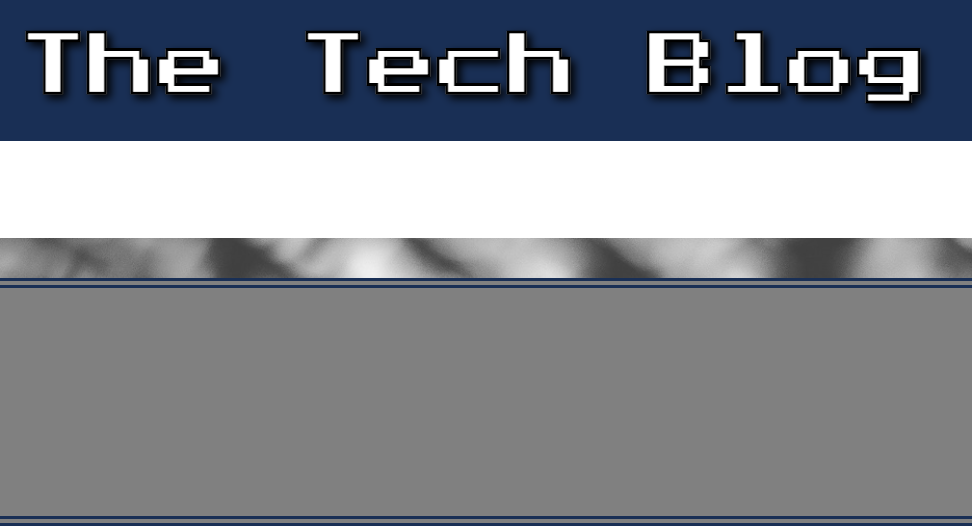
</a>

<h3 align="r">Model View Controller (MVC) Tech Blog</h3>
<p align="center">
    Login/Sign-up and starting posting here!
<br />

<br />
<a href="https://rossetti-mvc-tech-blog-5f23ac01a35f.herokuapp.com/">View Demo</a>
    ·
<a href="https://github.com/stephenrossetti/Rossetti-s-Model-View-Controller-MVC-Tech-Blog/issues">Report Bug</a>
    ·
<a href="https://github.com/stephenrossetti/Rossetti-s-Model-View-Controller-MVC-Tech-Blog/issues">Request Feature</a>
  </p>
</div>


<details>
<summary>Table of Contents</summary>
<ol>
<li><a href="#overview-of-rossettis-tech-blog"> Overview of MVC Tech Blog</a></li>
<li><a href="#user-story">User Story</a></li>
<li><a href="#acceptance-criteria">Acceptance Criteria</a></li>
<li><a href="#getting-started">Getting Started</a><li>
<ul>
<li><a href="#prerequisites">Prerequisites</a></li>
<li><a href="#installation">Installation</a></li>
</ul>
</li>
<li><a href="#built-with-&-technology-used">Technology Used</a></li>
<li><a href="#usage">Usage</a></li>
<li><a href="#links">Links</a></li>
<li><a href="#contributing">Contributing</a></li>
<li><a href="#license">License</a></li>
<li><a href="#contact-us">Contact Us </a></li>
<li><a href="#credits">Credits</a></li>
<li><a href="#acknowledgments">Acknowledgments</a></li>
</ol>
</details>

## Overview of Rossetti's Tech Blog

Model-View-Controller (MVC) Challenge: Tech-Blog, or Module-14's Challenge, was to build a CMS-style blog site similar to a Wordpress site, where developers can publish their blog posts and comment on other developers’ posts as well. This site was built completely from scratch and deployed to Heroku. The apps follows the MVC paradigm in its architectural structure, uses Handlebars.js as the templating language, Sequelize as the ORM, and the express-session npm package for authentication.

Along with other skills learned in previous challenges, this challenge tested our ability to utilize express-handlebars, MySQL2 and Sequelize, Express.js, dotenv, bcrypt, express-session and connect-session-sequelize.

## User Story

```
AS A developer who writes about tech
I WANT a CMS-style blog site
SO THAT I can publish articles, blog posts, and my thoughts and opinions
```

## Acceptance Criteria

```
GIVEN a CMS-style blog site
WHEN I visit the site for the first time
THEN I am presented with the homepage, which includes existing blog posts if any have been posted; navigation links for the homepage and the dashboard; and the option to log in
WHEN I click on the homepage option
THEN I am taken to the homepage
WHEN I click on any other links in the navigation
THEN I am prompted to either sign up or sign in
WHEN I choose to sign up
THEN I am prompted to create a username and password
WHEN I click on the sign-up button
THEN my user credentials are saved and I am logged into the site
WHEN I revisit the site at a later time and choose to sign in
THEN I am prompted to enter my username and password
WHEN I am signed in to the site
THEN I see navigation links for the homepage, the dashboard, and the option to log out
WHEN I click on the homepage option in the navigation
THEN I am taken to the homepage and presented with existing blog posts that include the post title and the date created
WHEN I click on an existing blog post
THEN I am presented with the post title, contents, post creator’s username, and date created for that post and have the option to leave a comment
WHEN I enter a comment and click on the submit button while signed in
THEN the comment is saved and the post is updated to display the comment, the comment creator’s username, and the date created
WHEN I click on the dashboard option in the navigation
THEN I am taken to the dashboard and presented with any blog posts I have already created and the option to add a new blog post
WHEN I click on the button to add a new blog post
THEN I am prompted to enter both a title and contents for my blog post
WHEN I click on the button to create a new blog post
THEN the title and contents of my post are saved and I am taken back to an updated dashboard with my new blog post
WHEN I click on one of my existing posts in the dashboard
THEN I am able to delete or update my post and taken back to an updated dashboard
WHEN I click on the logout option in the navigation
THEN I am signed out of the site
WHEN I am idle on the site for more than a set time
THEN I am able to view posts and comments but I am prompted to log in again before I can add, update, or delete posts
```

<p align="right">(<a href="#readme-top">back to top</a>)</p>

## Built With & Technology Used

- 

- 

- 

- 

- 

- 

- 

- 

- 

## Getting Started

How to get started with the MVC Tech Blog!

### Prerequisites

- npm

### Installation

Instructions on how to download our app.

1. Visit us @ [https://github.com/stephenrossetti](https://github.com/stephenrossetti/Rossetti-s-Model-View-Controller-MVC-Tech-Blog)
2. Clone the repo
   ```sh
   git clone git@github.com:stephenrossetti/Rossetti-s-Model-View-Controller-MVC-Tech-Blog.git
   ```
3. Install NPM packages

   ```sh
   npm install i
   ```

4. Source the database

   ```sh
   mysql -u root -p
   ```
   [Enter password]
    ```sh
   source db/schema.sql;
   ```
   [Exit]

5. Seed the database
     ```sh
   node seeds/seed.js
   ```

6. To run our app

   ```sh
   node server.js
   ```

<p align="right">(<a href="#readme-top">back to top</a>)</p>

## Usage

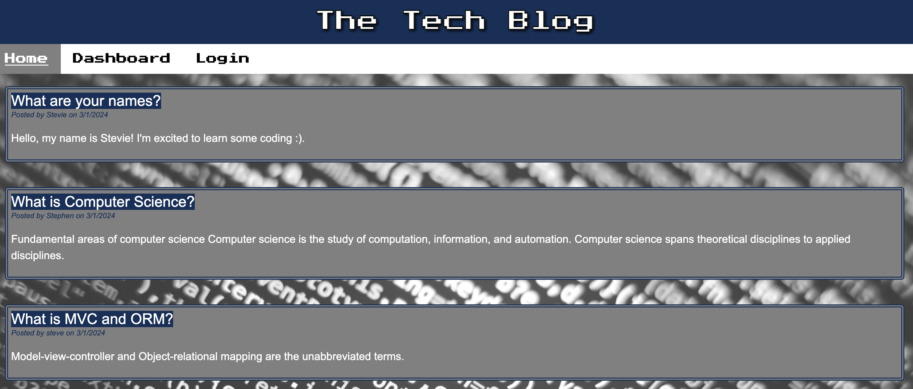
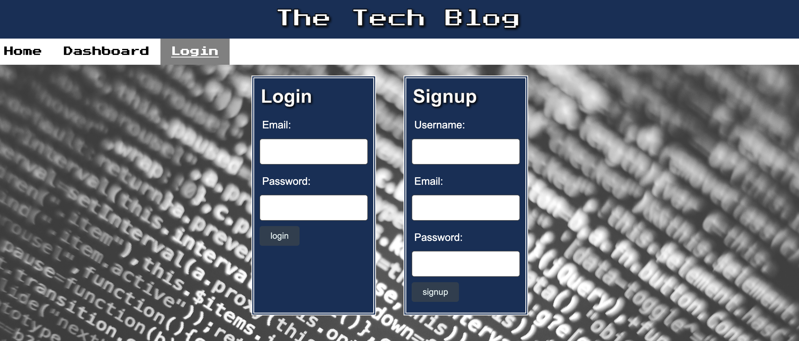
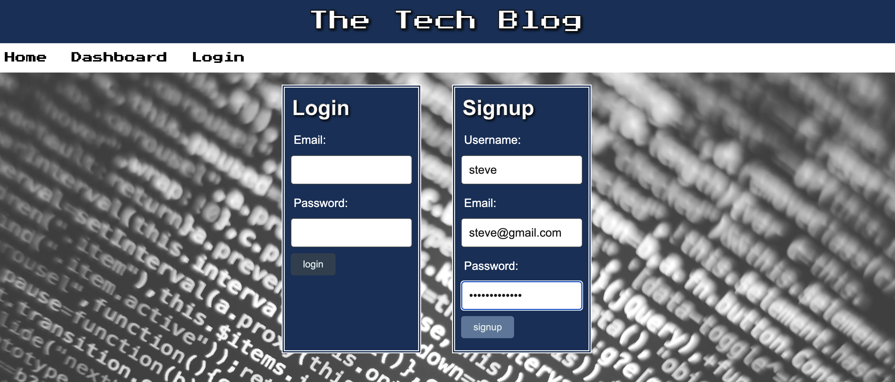
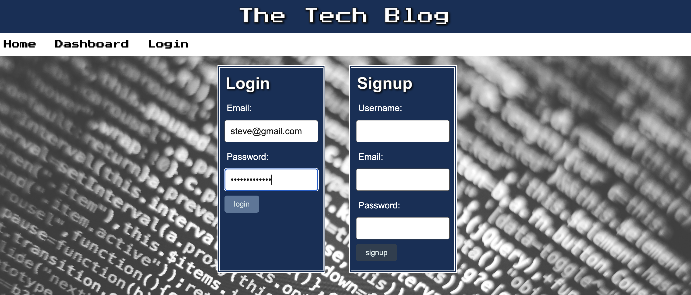
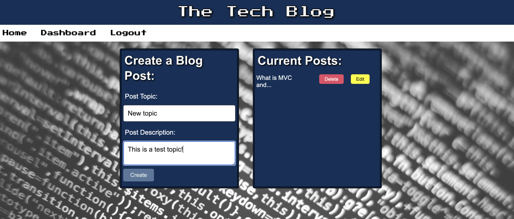
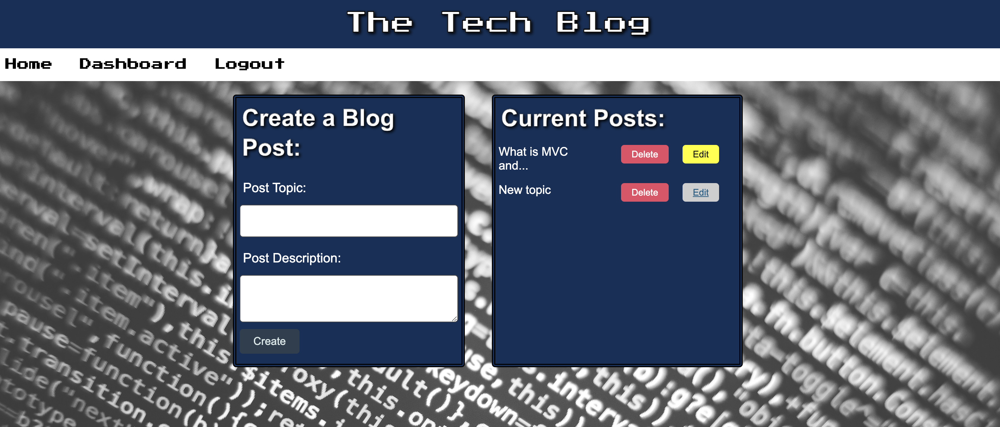
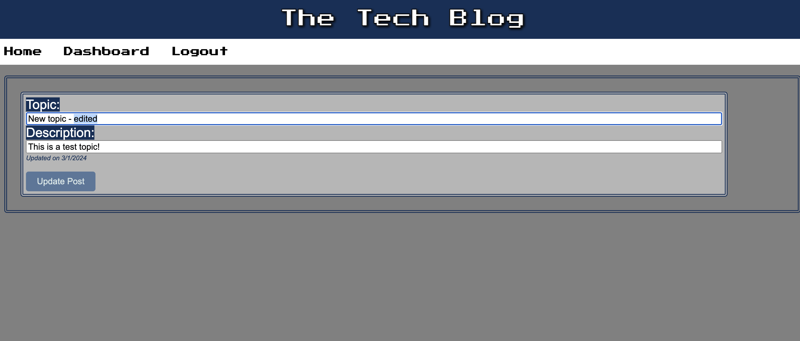
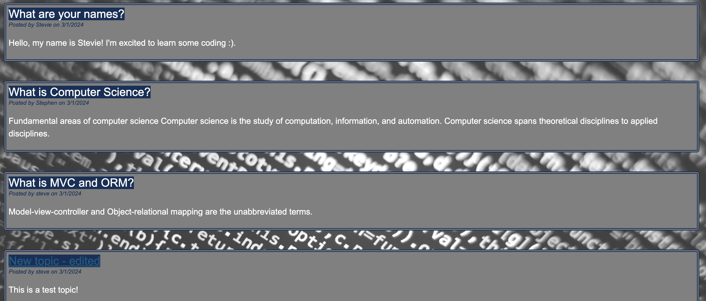
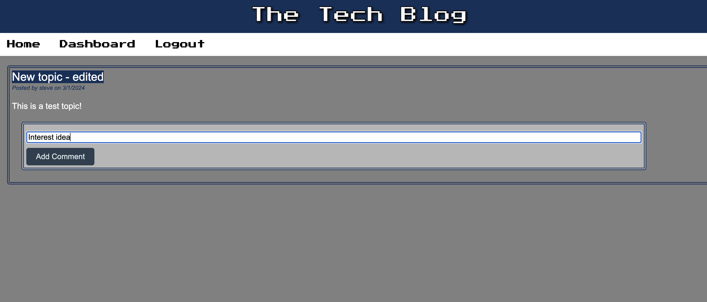
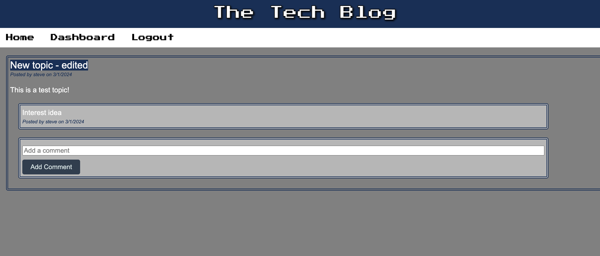
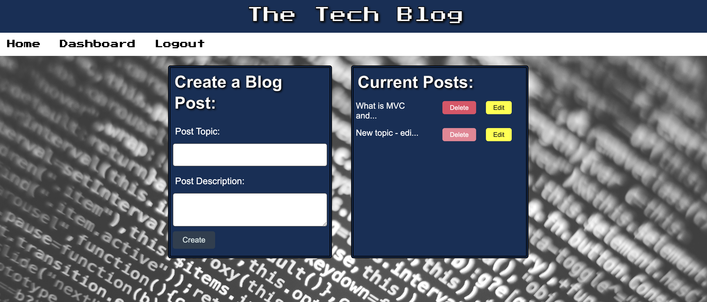

## Links
[The URL of the Heroku deployed application](https://rossetti-mvc-tech-blog-5f23ac01a35f.herokuapp.com/)

[The URL of the Github Repository](https://github.com/stephenrossetti/Rossetti-s-Model-View-Controller-MVC-Tech-Blog)

<p align="right">(<a href="#readme-top">back to top</a>)</p>

## Contributing

Here is how you can be apart of creating MVC Tech Blog.

1. Fork the Project
2. Create your Feature Branch (`git checkout -b [BRANCH NAME]`)
3. Commit your Changes (`git commit -m 'Add my commits to main'`)
4. Push to the Branch (`git push origin main`)
5. Open a Pull Request

<p align="right">(<a href="#readme-top">back to top</a>)</p>

## License

N/A

<p align="right">(<a href="#readme-top">back to top</a>)</p>

## Contact Us

Contact me ([Stephen Rossetti](https://github.com/stephenrossetti)) if you have any questions or feedback.

<p align="right">(<a href="#readme-top">back to top</a>)</p>

## Credits

Coding help from external sources:

- Utilized Module-14-Mini-Project (Crowdfunding App) as a template to begin coding the website. Included most of the functionality except for comment models, relationships, and javascript/controllers for adding comments and editing blog posts.
- Utilized my own Project-2 (Convention Planner) app for design and handlebars.
- Utilzied TAs and office hours for help with front-end/back-end GET requests that involved multiple models. Also, applying those GET requests within handlebars.
- Utilized StackOverflow for miscellaneous code help and ideas.

<p align="right">(<a href="#readme-top">back to top</a>)</p>

## Acknowledgments

Thanks to our resources on creating our app!

- [Visual Studio Code](https://code.visualstudio.com/)
- [Heroku Installation](https://coding-boot-camp.github.io/full-stack/heroku/deploy-with-heroku-and-mysql)
- [Insomnia](https://img.shields.io/badge/Insomnia-black?style=for-the-badge&logo=insomnia&logoColor=5849BE)
- [Static Badges](https://shields.io/badges)

<p align="right">(<a href="#readme-top">back to top</a>)</p>

[contributors-shield]:https://img.shields.io/badge/CONTRIBUTORS%20--4?style=for-the-badge&logo=gitlab&labelColor=WHITE
[contributors-url]: https://github.com/stephenrossetti/Rossetti-s-Model-View-Controller-MVC-Tech-Blog/graphs/contributors